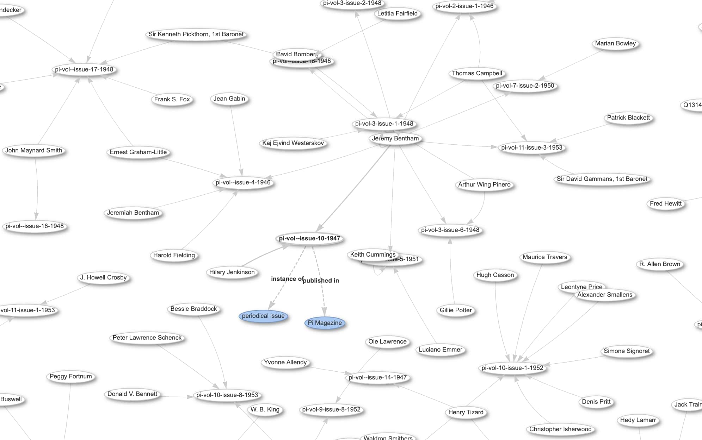

# Newspaper-Semantic-Enrichment
The repository is developed to process a collection of articles extracted from the Pi newspaper and identify people, places and classify these into a set of topics. It links individual to Wikidata Q-IDs, adds geolocation information and assign articles to one of the 12 topics from the Newswire pre-trained models. The final output is a JSONL file which contains the article, the NER entities and newspaper metadata.

## Pipeline (Jupyter notebooks) 
The JSON/JSONL is extracted using <a href="https://github.com/kstepanyan/Newspaper-OCR-LLM/tree/main">Newspaper-OCR-LLM </a>repository. The extracted artices are then pre-processed (i.e. cleaned and normalised). The pre-processed files are then used for NER, geotaggin, wikidata reconsiliation and classification into topics.

## The repository contains two notebooks:

**Notebook 1: pre-processing** 
- clean and prepare data for processing.

**Notebook 2: semantic-processing**
- detect and extract NER entities (people, places),
- reconcile entities to Wikidata Q‑IDs,
- geocode places,
- assigns articles to one of the 12 topics using Newswire pre-trained models.
- exports the data in JSONL that resembles the <a href="https://huggingface.co/datasets/dell-research-harvard/newswire">Newswire dataset</a>
***Notebook 2: Cells 9 and 10***
  - These cells export the data in a CSV format that for easy processing in OpenRefine and Wikidata uploads.
  - The CSV files are generated in:
    --csv-exports/locations_mentioned.csv
    --csv-exports/people_mentioned.csv 

## Some of the extracted data is exposed through Wikidata
Examples of Wikidata exposure are available here:

See <a href="https://www.wikidata.org/wiki/Wikidata:UCL_periodicals">UCL Special Collections and Wikidata </a> Wikidata Project Page for details.